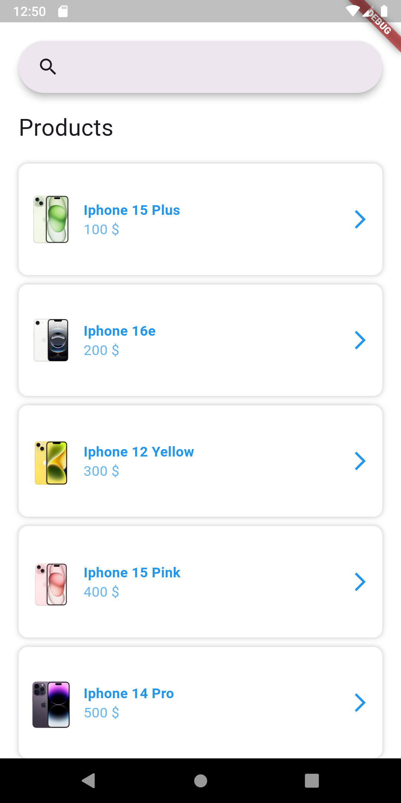
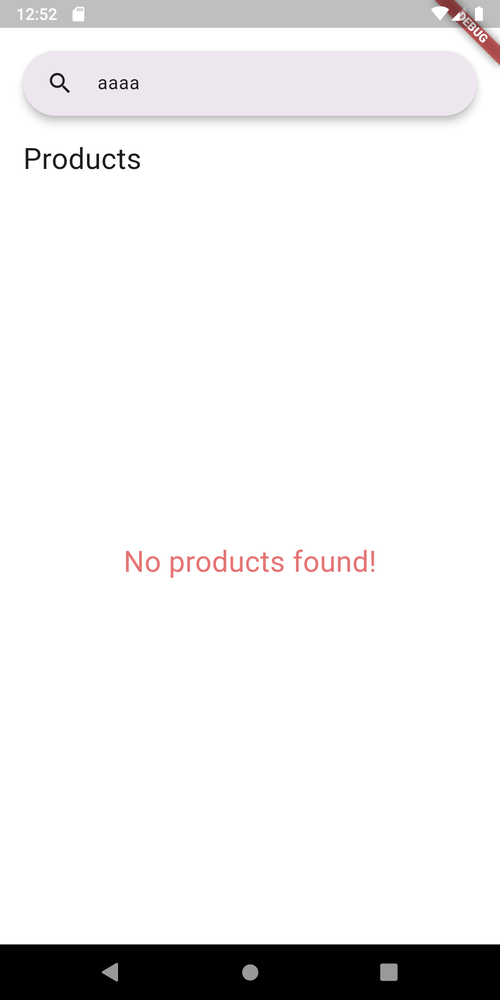

# flutter_clean_architecture

Flutter app using [Clean Architecture x Provider]

## 📱 Screenshots

|  |  |  |  |
| ----------------------------- | ----------------------------- | ----------------------------- | ----------------------------- |

## 🚀 Requirement

- Flutter **3.24.0+**
- Dart **3.5.0+**
- Android Studio/VSCode
- Java 11+ (Android)
- CocoaPods (iOS)

## 🛠️ Setting

```bash
git clone https://github.com/Dev-NamNguyen/Demo-Mobilio.git
cd ./Demo-Mobilio
flutter pub get
```

# Run with default equipment

flutter run

# Run with specific equipment

flutter run -d [device_id]

## 🛠️ Structure

.

```bash
lib/
├── core/
│ ├── mock/
│ ├── res/
│ ├── network/
│ └── utils/
│ └── routes/
└── feture/name-feature/
│ ├── data/
│ │ ├── services/
│ │ ├── models/
│ │ └── repositories/
│ ├── domain/
│ │ ├── entities/
│ │ └── repositories/
│ │ └── usecases/
│ └── presentation/
│ ├── view_model/
│ ├── screens/
│ └── widgets/
└──

```
